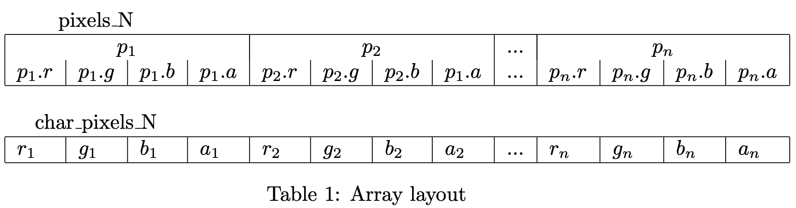
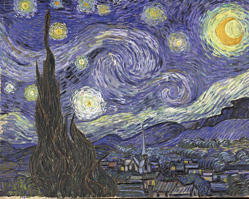
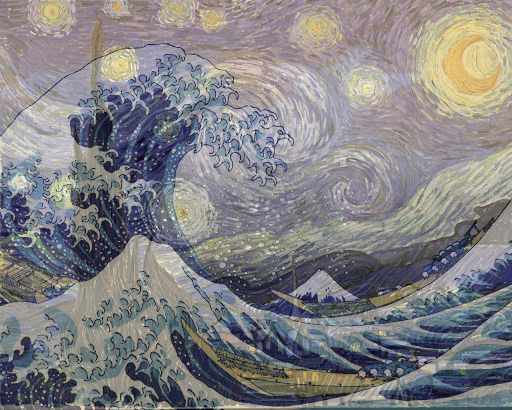

# C intro

## Introduction
This exercise will serve as an introduction to the C programming language, as
well as the tools needed to compile and run them.

You task will be to read two images, and produce a new image that is the
average of the two across all color channels. That is, for each pixel for each
channel R, G, B (red, green, blue), take the average of those two values as your
new value. So Rout = (Rin1 + Rin2)/2, etc.

The hand-out code already contains sections for reading and writing images,
with annotated sections for you to insert your own code.

Important: When you deliver your code, for this problem set and future
ones, make sure that you only deliver the files explicitly asked for. This will only
include code you have edited yourself, and not binary files, example input, etc.
A consequence of this is that **you are not allowed to utilize external libraries
not already included in the hand-out code**.

## Task
1. Test the program. Compile and run with two images as input. It should
save the first input-image as an image called ”output.png”
2. Cast the unsigned character pointers as pixel-pointers and save them in
two variables, one for each input image. This pointer will act as a ”mask”,
allowing you to access the bytes more conveniently. See Table 1 for illustration.
3. Allocate memory for an output pixel array using malloc(). The dimensions
of the image(s) are saved in the variables height and width and you can
get the size of a single pixel by using the sizeof() function.
4. Iterate through the pixels in the two input images, and calculate the appropriate 
output values, the average of each color channel, saving them in the output array.
Remember to set the opacity (alpha) value of each pixel as well, this can
simply be set to 255, which is its maximum.

5. Free the memory from the dynamically allocated arrays. That is, free the
two input arrays (either the character pointers or the pixel pointers, they
point to the same address), and the output pixel array.
6. Compile and run your code with the two provided test-images. See that
the output matches the example output.

## Result

  
  

  

