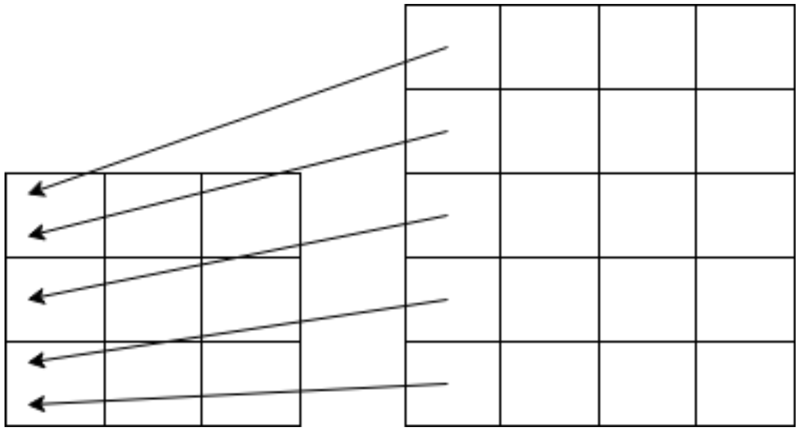

### Message Passing Interface (MPI): Introduction 
# Image Scaling with Bi-Linear Interpolation
This exercise will serve as an introduction to MPI. You will take a pre-written algorithm for image scaling that utilizes bilinear interpolation, and write a distributed version of this program.

#### Technology
- OpenMPI 4.1.1

## Program description
[Bilinear interpolation](https://en.wikipedia.org/wiki/Bilinear_interpolation) is an method for producing a value for an unknown function at a point by taking a weighted average of true values surrounding this point. In our case, we will use this to scale up an image. For each pixel in the new image, we map it to the corresponding point in the old image, and take a weighted average of the 1-4 corresponding pixels. A rough illustration of this mapping can be seen in Figure 1. The program utilizes the same pixel-structure used in the previous assignment *(00 - Intro to C)*.


<p align="center">
    
</p>
&nbsp;&nbsp;&nbsp;&nbsp;&nbsp;&nbsp;Figure 1: Illustration of mapping the first column of the upscaled image to corresponding positions in the original. Because the grids don’t line up perfectly, we take a weighted average of the closest pixels.  

&nbsp;  

The hand-out code can be run by compiling and providing any jpg/png image as input. For the MPI paralellization tasks, you are only required to make it run correctly with the provided input image, but it should produce the correct output for any integer scaling.

Before you begin the tasks, you should start by testing the program. 
Compile using:
```sh
mpicc main_serial.c
```
and run using:
```sh
mpirun -np 1 ./a.out input.jpg 2 5
```
This should create an image called **”output.png”**, looking like the original but with the width doubled and the height quintupled. You can adjust the **”-np”** flag to run multiple copies of the program. This is a good way to ensure that mpi is installed and running correctly.

We recommend making a copy of the serial code, as a sanity check and point of comparison as you start parallelizing using MPI.

## Task
The following tasks are all marked by with corresponding TODO-comments in the handout code. After each task, you should ensure that the program compiles, though it might not run after some of the changes.

##### TODO 1: Initialize the MPI environment and retrieve the size of the MPI COMM WORLD communicator, as well as each process’ rank within this communicator. Finalize MPI at the end of main() before it returns.
   
##### TODO 2: Only the rank 0 process should read the image. Broadcast the dimensions, as well as the image itself, from rank 0 to the other processes.
   
##### TODO 3: While each process has access to the whole input, they should only produce part of the output. Set the local dimensions to partition the output evenly among the processes. Allocate space for the local partial output.
**The program will likely trigger a segmentation fault if run after these changes, which will be fixed in task 5.**
> Note: You are allowed to assume that the width and height of the output are divisible by the number of processes. The example input is 1024x1024 pixels, which means you can run any integer scaling with a number of processes that is a power of 2.

##### TODO 4: Perform the computation. You need to iterate through pixels in the local partition of the output, and save the output from the bilinear() function accordingly. Note, however, that bilinear() expects global row and column coordinates. This means you need to find a mapping between the local and global indices when you calculate the variables ”row” and ”col”.
   
##### TODO 5: Allocate space in rank 0 for a complete output image and gather the results from all the processes. If you have assumed image dimensions that are divisible by the number of processes, you can use MPI Gather(), otherwise you need to use MPI Gatherv(). Only rank 0 should write the image to file.

##### TODO 6: The program should run error-free and produce the correct output for any integer scaling and with *1*, *2*, *4* or *8* processes.

## Result

### Original image
<p align="center">
     
</p>


### Each process gives the following section of the image:
> Using 4 processes and scaling **2 x width** and **4 x height**

<p align="center">
    <b>Process 3</b>
</p>
<p align="center">
     
</p>
<p align="center">
    <b>Process 2</b>
</p>
<p align="center">
     
</p>
<p align="center">
    <b>Process 1</b>
</p>
<p align="center">
     
</p>
<p align="center">
    <b>Process 0</b>
</p>
<p align="center">
     
</p>

</br>
</br>

<p align="center">
    <b>Together they create the following output:</b>
</p>
<p align="center">
     
</p>
