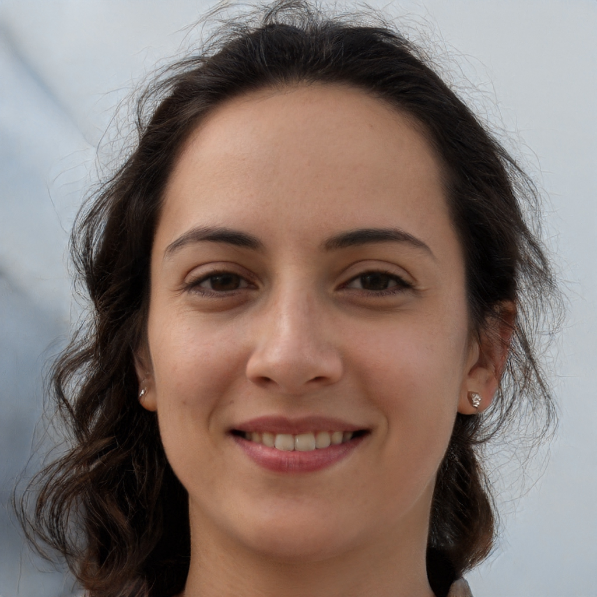

# Part 2: Parallel image morphing using MPI

For this exercise, you will take a pre-written serial implementation of the Beier-Neely algorithm and write a distributed version of this program.

The Beier-Neely algorithm is a process of morphing an image. Given an image and a set of feature lines, each meant to outline some feature in the image, like the angle of a mouth, the position of a jawline, ear, etc., the algorithm creates a new image for a new set of positions for these lines. The process of creating the morphed output image is to for each output-pixel determine a single position in the input to extract color values from. In short, for each pixel, we look at all the lines in the out-image to determine their relative closeness, and then use that information to find a corresponding position in the in-image to extract our color from. So the morphed image will look similar to the source- image close to each line, while looking more warped elsewhere.

A common use-case for this algorithm, and the one we will implement here, is to create a series of morphed images to transition from one image to another. Two input images, each with their corresponding feature lines, are morphed towards a set of equal line positions. If we calculate those common position as a weighted average of the two input sets, and fade the images in and out in a similar fashion, we can create a continuous transition, where one image warps into another.


### Compile and Run

##### Compilation
To compile the program run:
```
make main
```


##### Execution

```sh
mpirun -np N ./main src.jpg dst.jpg outpath/ STEPS lines.txt
```
Example:
```
mpirun -np 1 ./main images/man9.jpg images/man10.jpg output-png/ 10 lines/lines-man9-man10.txt
```

STEPS is the number of ”in-between”-images you want between the source and destination images. Runtime of the program does increase linearly with this number, so keep it low, e.g. 3, if you just want to test cor- rectness. Keep in mind that the ”-np” flag has no real effect until you implement the MPI-functionality.
You can use any two images, but the line-sets provided corresponds to the images, so your output will look interesting if you use different im- ages.


## Tasks

Your task will be to parallelize the serial program using MPI, similarly to PS1 assignment. These are the requirements:

- Each process/rank should only produce one part of the output image. This includes not allocating more space than is necessary for this partition.
- The input is broadcast across all processes. This is because each output pixel is dependent on every pixel in both the input images and their line sets.
- Only rank 0 should read the input and write the final output image(s) to file. This means you need to gather the output partitions before writing.
- You can assume the image size is a power of 2.

##### A suggested approach:

1. Test the program. Compile and run using a single process.
2. Set up necessary MPI-variables and broadcast the input.
The variables p, a and b are already broadcast. These are optional variables for the Beier-Neely algorithm.
3. Allocate partition space.
4. Implement the gather and test it. Perhaps on one of the input images?
5. Implement the necessary changes for each process to calculate its output partition. Be mindful of where you are working on coordinates in the local partition and where there are coordinates in the (global) input and output images.

## Results

For each test case i am running the script `run.sh` (90 steps).
```
mpirun -np 4 ./main images/woman-1.jpg images/woman-2.jpg out/images/ 90 lines/lines-women.txt
```

### Before

**Single process**
```
Morphing with 1 process
Performed 90 steps in 247.71 seconds
```

**Four processes**
```
Morhing with 4 Processes
Performed 90 steps in 250.10 seconds
```

As we would imagine, since all the processes are running the exact same code, it takes the same amount of time for 4 processes as for 1 (with more overhead and memory usage because of duplicat data).

### After

**Single process**

```
Using 1 process to perform 90 steps
Morphing images: [####################################################################################################] 100.0%
1 Processes performed 90 steps in 249.04 seconds
```

The time with a single process hasnt changed much.

**Four processes**
```
Using 4 processes to perform 90 steps
Morphing images: [####################################################################################################] 100.0%
4 Processes performed 90 steps in 126.00 seconds
```

After the changes we see that by increasing the amount of proceses we are reducing the time. With 4 processes the program runs **2** times faster than with only 1 process.

### video

In my testing i am morphing the following two images (source is to the left, destination is to the right).
<p align="center">
  
  
</p>


Using the script in `scripts/generate_video.sh` i created the following video, merging all the steps together.

> The script uses ***ffmpg***

<p align="center">
  
</p>
